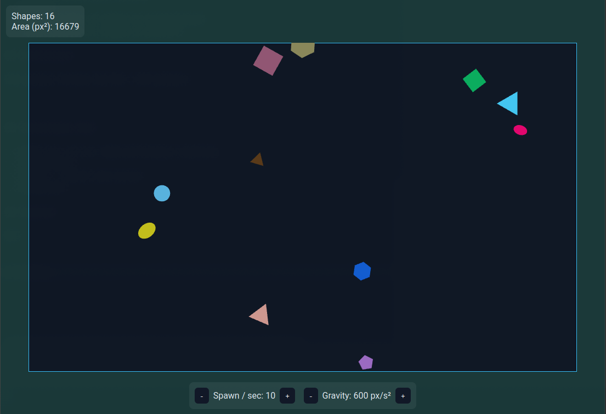

# PIXI_Shapes

Interactive test game written in TypeScript using PIXI.js lib
## Requirements

- Node.js (версия 16 или выше)
- npm или yarn

## Setup

1. Clone this repo:
```bash
git clone https://github.com/StormAxs/pixi_shapes
cd pixi_shapes
```

2. Install dependencies:
```bash
npm install
```

## Development

Start the dev-server:
```bash
npm run dev
```

You'll be able to access application by your localhost ip


## Functionality

- **Falling shapes**:  Random shape generation with included gravity and size
- **Shape types**: Triangle, square, pentagon, hexagon, circle, ellipse, and fully random shapes (Up to 7 rects)
- **Interactivity**:
  - Clicking inside the rectangle spawns a new shape at the click position
  - Clicking a shape removes it
- **Controlls**:
  - Editable shape spawn-rate (shapes/sec)
  - Editable gravitation setting
- **Stats**:
  - Current number of shapes on screen/canvas
  - Total area of all shapes in pixels^2

## Architecture

The project follows the MVC + OOP pattern:


## Technologies Used

- **PIXI.js** v7.2.0 -High-performance rendering
- **TypeScript**
- **Vite** - build & dev-server
- **HTML/CSS**

## Лицензия

MIT


# Showcase

